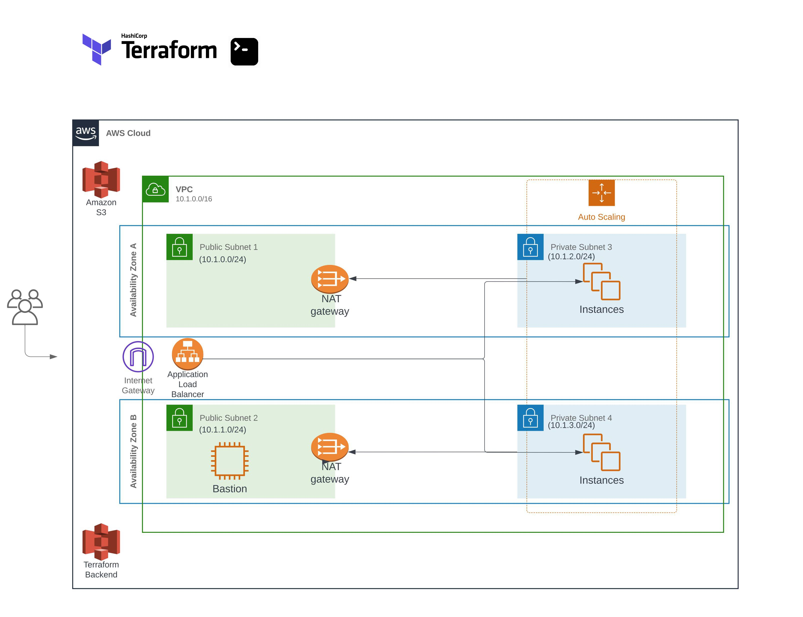

# Deploying AWS infrastructure with Terraform



## Overview
This repository contains Terraform code that sets up a comprehensive proof-of-concept environment in AWS. The infrastructure is managed using Terraform and includes various components to demonstrate different AWS features and services.

## Components

### VPC and Subnets
- 1 VPC with CIDR block: 10.1.0.0/16
- 4 subnets spread evenly across two availability zones:
   - Sub1 – 10.1.0.0/24 (accessible from the internet)
   - Sub2 – 10.1.1.0/24 (accessible from the internet)
   - Sub3 – 10.1.2.0/24 (not accessible from the internet)
   - Sub4 – 10.1.3.0/24 (not accessible from the internet)

### NAT Gateway Configuration
- Configures two NAT gateways in the VPC for two public subnets, facilitating SSH access to the web servers from a bastion host.

### EC2 Instance
- 1 EC2 instance running Red Hat Linux 9.2 in subnet Sub2
- Configuration:
  - Instance Type: t2.micro
  - Storage: 20 GB

### Auto Scaling Group (ASG)
- 1 Auto Scaling Group that spreads instances across subnets Sub3 and Sub4
- Configuration:
  - AMI: Red Hat Linux 9.2
  - Instance Type: t2.micro
  - Storage: 20 GB
  - Number of Instances: Minimum 2, Maximum 6
- Scripted installation of Apache Web Server (httpd) on ASG instances

### Application Load Balancer (ALB)
- 1 Application Load Balancer (ALB) listening on TCP port 80 (HTTP)
- Forwards traffic to the ASG in subnets Sub3 and Sub4
- Security groups are used to allow necessary traffic

### S3 Bucket with Lifecycle Policies
- 1 S3 bucket with two folders:
  - "Images" folder: Move objects older than 90 days to Glacier.
  - "Logs" folder: Delete objects older than 90 days.

## Conditional Module Inclusion
The Terraform configuration includes modules for creating a bastion host and a Vault server. These modules are included conditionally based on variables (`deploy_bastion` and `deploy_vault`) to determine whether these resources should be deployed.

For example:
```hcl
module "bastion" {
  source        = "github.com/AA90416/acme-bastion-demo/modules/bastion"
  count         = var.deploy_bastion ? 1 : 0
  subnet_id     = module.vpc.pub_sub1_id
  bastion_ami   = var.bastion_ami
  instance_type = var.bastion_instance_type
  key_name      = var.key_name
  vpc_id        = module.vpc.vpc_id
}

module "vault" {
  source        = "github.com/AA90416/acme-vault-demo/modules/vault"
  count         = var.deploy_vault ? 1 : 0
  subnet_id     = module.vpc.pub_sub2_id
  ami           = var.vault_ami
  instance_type = var.vault_instance_type
  key_name      = var.key_name
  vpc_id        = module.vpc.vpc_id
  user_data     = filebase64("${path.module}/instance_scripts/vault_install.sh")
}
```

### Remote Modules
This project utilizes remote modules hosted on GitHub instead of storing the module code within this repository. The `source` attribute points to the GitHub repository where the module code resides. This approach promotes reusability and modularity.

Example:
```hcl
module "vpc" {
  source = "github.com/AA90416/acme-vpc-demo/modules/vpc"
  ...
}
```

## Initializing and Applying the Terraform Configuration

Follow these steps to correctly initialize and apply the Terraform configuration:

1. **Navigate to the `backend` Folder and Initialize:**
   - Go to the `backend` folder to initialize the Terraform environment:
   ```bash
   cd acme-terraform-infra-demo/backend/
   terraform init
   ```

2. **Apply the Configuration in the `backend` Folder:**
   - While still in the `backend` folder, apply the configuration to set up the backend:
   ```bash
   cd acme-terraform-infra-demo/backend/
   terraform apply -var-file="terraform.tfvars"
   ```

3. **Switch to the Root Directory and Initialize the Backend:**
   - Navigate back to the root folder of your Terraform project and initialize using the backend that was just created:
   ```bash
   cd acme-terraform-infra-demo/
   terraform init -backend-config=backend-config.hcl
   ```

4. **Apply the Configuration from the Root Directory:**
   - Now, apply the Terraform configuration from the root directory:
   ```bash
   cd acme-terraform-infra-demo/
   terraform apply -var-file="terraform.tfvars"
   ```

This sequence ensures that the Terraform state is correctly stored in the remote backend and that the infrastructure is provisioned as expected.

## Prerequisites
- [Terraform](https://www.terraform.io/downloads.html) installed on your local machine (version "~> 1.2").
- AWS IAM user credentials with sufficient permissions to create the infrastructure resources.
- AWS CLI installed and configured.

## Clean Up
To remove the created infrastructure and resources, run `terraform destroy -var-file="terraform.tfvars"`.

## Contact
If you have any questions or need further assistance, feel free to reach out to the project owner:

- Name: Roberto Otero
- Email: rotero82@gmail.com

## License
This project is open-source and licensed under the [MIT License](LICENSE).
